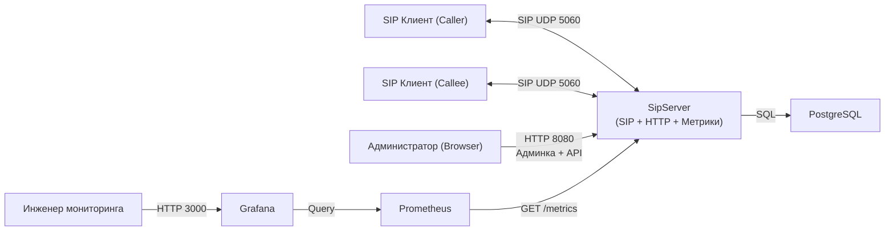
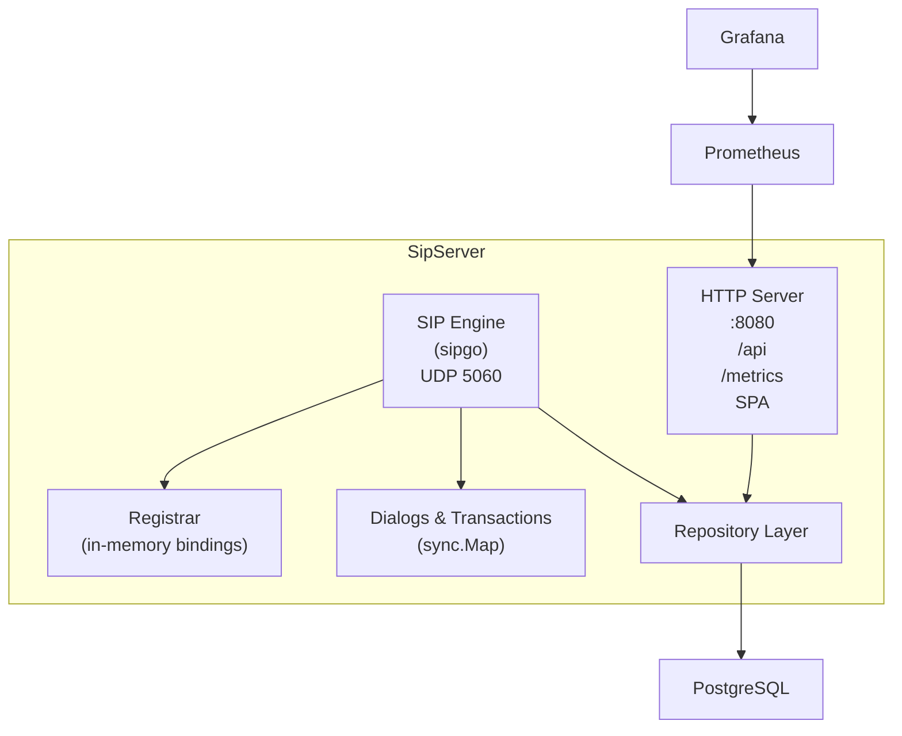
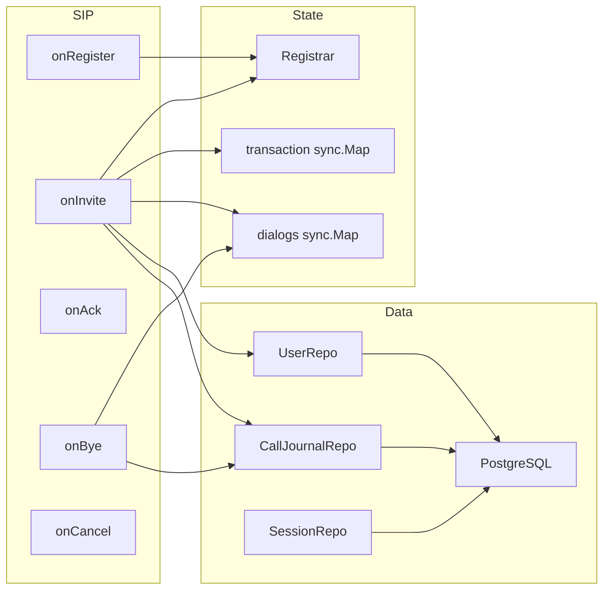
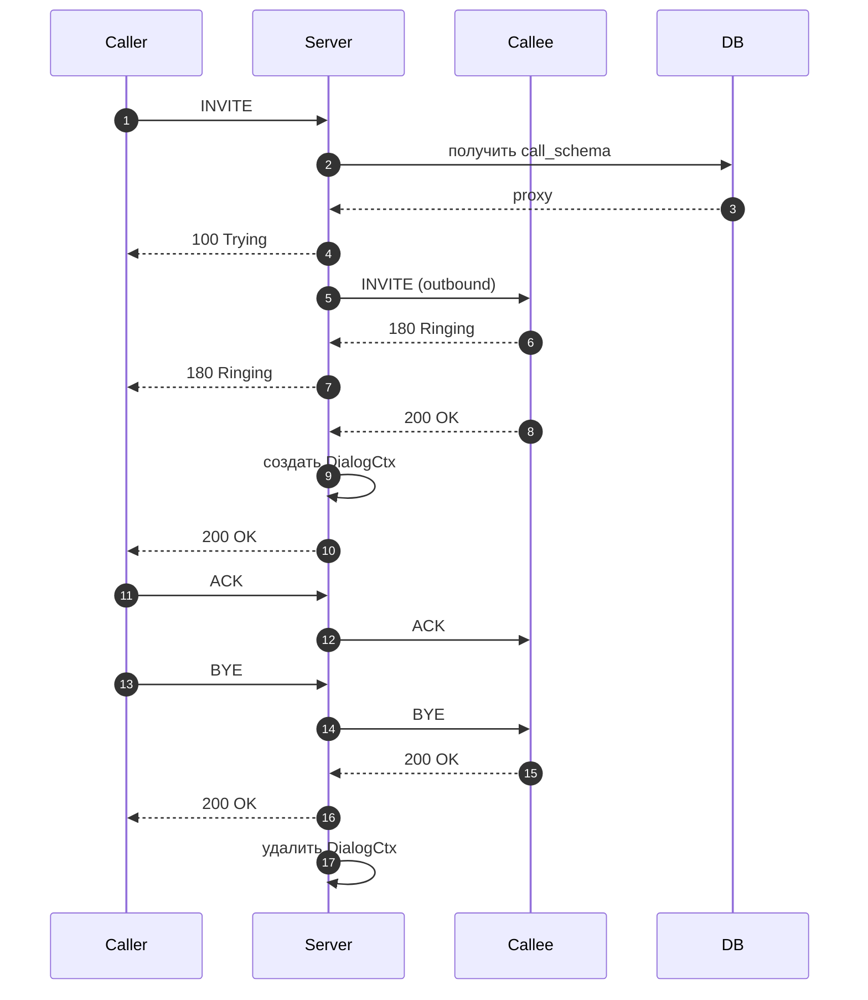
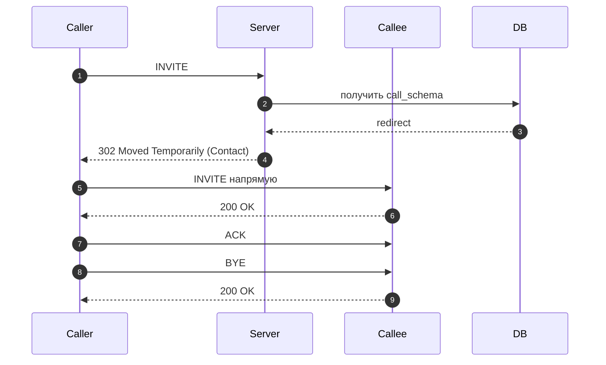

# SipServer

Мини-PBX прототип на Go:  
**SIP-сервер (Registrar + Proxy / Redirect)** + **HTTP API** + **React-админка** + **Prometheus метрики** + **Grafana мониторинг**.

Проект демонстрирует архитектуру SIP-сигнализации с управлением через HTTP и полной наблюдаемостью.

---

# 1. Назначение системы

SipServer — это сигнальный сервер SIP, который:

- принимает REGISTER
- маршрутизирует INVITE
- поддерживает два режима маршрутизации (Proxy / 302 Redirect)
- хранит состояние диалогов
- записывает журналы звонков
- предоставляет HTTP API и веб-админку
- экспортирует метрики для Prometheus

---

# 2. Архитектура (C4 Model)

Диаграммы приведены в формате Mermaid (рендерятся в GitHub).

---

## 2.1 Контекст системы (C4 Level 1)



---

## 2.2 Контейнеры (C4 Level 2)



---


## 2.3 Компоненты (C4 Level 3)



---

## 3.SIP-сервер
### Поддерживаемые методы

- REGISTER
- INVITE
- ACK
- BYE
- CANCEL

---

## 4.Режимы маршрутизации INVITE

**Режим выбирается из конфигурации пользователя (в БД).**

---

## 4.1 Proxy Mode (proxy)

### Сервер:

- проксирует INVITE

- проксирует ответы

- создаёт контекст диалога

- обновляет CDR

- считает активные диалоги

---
## Sequence Diagram — Proxy



---

## 4.2 Redirect Mode (redirect)

### Сервер:

- отвечает 302

- возвращает Contact

- дальше в сигнализации не участвует

---

## Sequence Diagram — Redirect



---

## 5.HTTP API и Админка

### REST API

```bash
GET    /api/users
POST   /api/users
PUT    /api/users/{id}

GET    /api/sessions
GET    /api/call_journals
```

---

## Админка

- React SPA
- DEV режим: http://localhost:5173 `make run-front`

---

## 6.Метрики и мониторинг

Метрики доступны на:

```bash
GET /metrics

```

---

### SIP

- sip_messages_total
- sip_responses_total
- sip_handler_duration_seconds
- sip_active_dialogs
- sip_transactions_in_flight
- sip_registrations

---
### HTTP

- http_requests_total
- http_request_duration_seconds
- http_in_flight_requests

---
### Go runtime

- go_goroutines
- process_cpu_seconds_total
- process_resident_memory_bytes

---

## 7.Порты

| Компонент  | Порт     |
| ---------- | -------- |
| SIP        | 5060/udp |
| HTTP       | 8080     |
| Prometheus | 9090     |
| Grafana    | 3000     |
| React Dev  | 5173     |


---

## 8.Запуск

Требования

- Go 1.22+
- Node.js 18+
- Docker + docker compose

---

### Быстрый запуск

```bash
make run
```

#### Поднимаются:

- Postgres
- Prometheus
- Grafana
- Go сервер

## Адреса

**Админка:**  
http://localhost:8080/

**Метрики:**  
http://localhost:8080/metrics

**Prometheus:**  
http://localhost:9090

**Grafana:**  
http://localhost:3000  

Данные для входа в Grafana:  
login: `admin`  
password: `admin`


---
## 9.Проверка мониторинга


#### Проверить `/metrics`

```bash
curl http://localhost:8080/metrics
```

#### Проверить Prometheus

Открыть в браузере:

```bash
http://localhost:9090/targets
```

Статус таргета должен быть `up`

#### Проверить Grafana

1. Открыть Grafana
2. Перейти в Explore
3. Выполнить запрос:

```
up
```

Ожидаемый результат: `1`

Это означает, что Prometheus успешно скрейпит SipServer.

---
## 10. Ограничения

- ❌ Нет SIP Digest Authentication
- ❌ Нет TLS
- ❌ Нет RTP proxy
- ❌ В режиме redirect сервер не отслеживает жизненный цикл диалога

 ---
## Автор

Проект разработан в учебных целях.  
Автор: **usernaimandrey**

---

## Лицензия

MIT
